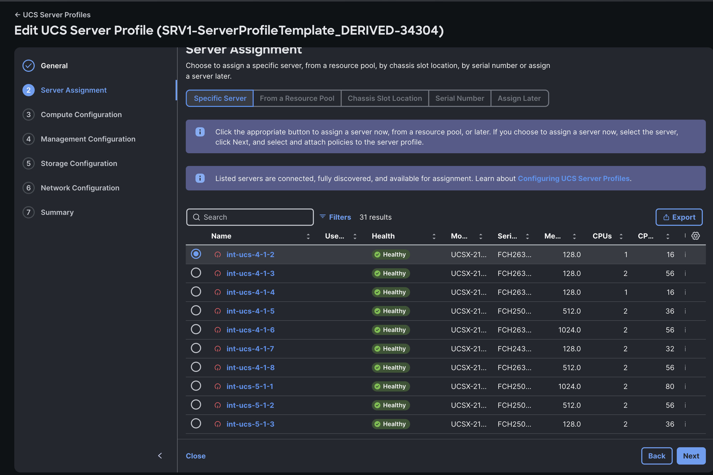

# Task 4: Decommission and Recommission

Sometimes your server still hasn’t discovered correctly, and you might want to do a more thoroughly rediscover. The way how to do that is by decommissioning and recommissioning your server.

Go to your server page and click Action -> System -> Decommission

**Attention! This is a disruptive operation!**  
**Attention! Do not select "Secure erase"!**  
Read the pop-up message and click on Decommission.
You will see that the server is immediately not pingable anymore. 
The decommission will start with an Undeploy Server Profile Workflow which will clear all the server identifiers like the MGMT ip, MAC address, UUID and turn the server off.

The Undeploy workflow will take about 2 minues and after you will see the Blade Decommission workflow. This will reset the server back to factory defaults and completely remove the device registration in Intersight. That is why sometimes this is also referred to as a Deep Rediscovery
The Blade Decommission workflow will take about 6 minutes. 

Now if you which to Recommission the server you need to navigate to
Fabric Interconnect -> [[IMM-Domain-Name]] FI-A or B doesn’t matter -> Connections -> Decommissioned Servers.
Find your [[ServerName]] in the list and click the three dots behind it and choose Recommission

Accept the pop-up and you will see that the server is removed from the list of Decommissioned servers but is not yet in the Server list.

This will take about a minute or so and then a Blade Discovery will start. This Blade discovery will take longer as the server needs to boot. This might be a good time to get a fresh cup of coffee as it will take about 15 minutes.
When the Blade Discovery is finished you will have to assign your previous Server Profile to the server again. Please go to:

Configure -> Profiles -> UCS Server Profiles -> Click on the Name of your Server Profile. (it will begin with SRV[[PodNumber]]-ServerProfileTemplate_DERIVED)
All you got to do now is assign this Server Profile again and deploy it by clicking on Action -> Edit

click Next and now select the server that is assigned to you.

Click Next a couple of times until your reach the Deploy button and click Deploy. 

Select “Reboot Immediately to Activate” and click on Deploy

The Deploy Worfklow will take about 7 minutes.
When it is finished the server will need to be completly up again, with the previous ESXi installation still deployed, and ping should work again.

The deploy and reboot will need some time so enjoy another 10 minute break and feel free to talk to us while you wait.
